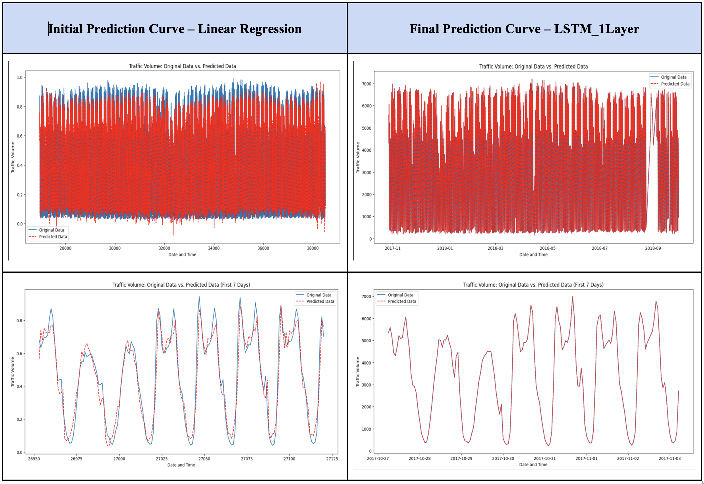

# Traffic Flow Volume Prediction

**Problem Definition**: 
I approach real-time traffic volume prediction as a multivariate time-series problem, where my model estimates future traffic flow at time steps Tt+1 to Tt+f based on t-hours of historical observations (from Tt-l to Tt), with f being the prediction horizon and l being the length of past observations.

**Objective**:
To develop an efficient and accurate traffic flow volume prediction system, I will conduct a comprehensive analysis and comparison of Machine Learning models (Linear Regression, SVM, Random Forest Regression, XGBoost) and Neural NetworkResults and Reflection TM, BI-LSTM, CNN-LSTM). This project will involve rigorous data preprocessing, feature engineering, hyperparameter tuning, and exploratory data analysis to optimize the performance of ML models. The performance of each model will be assessed using the following metrics: MAE, RMSE, MAPE, and R2 scores.

## Dataset Information

The Metro Interstate Traffic Volume dataset consists of 48,204 records collected from sensors installed at the MN DoT ATR station 301 on the Hourly Interstate 94 Westbound, located between Minneapolis and St Paul, MN. The dataset includes information on hourly traffic volume, weather conditions, and holidays to analyze their impact on traffic flow. Attributes featured in the dataset are holiday, temperature (in Kelvin), rainfall (mm/hour), snowfall (mm/hour), cloud cover percentage, weather descriptions (short and long), date and time (in local CST), and the hourly traffic volume on I-94 ATR 301 westbound.

Link: [https://archive.ics.uci.edu/ml/datasets/Metro+Interstate+Traffic+Volume\#](https://archive.ics.uci.edu/ml/datasets/Metro+Interstate+Traffic+Volume)

## Data Analysis

1.  **Data cleaning**: Removed duplicates based on the 'date_time' attribute and outliers present in 'temp' and 'rain_1h' attributes using cutoff for outliers as 1.5 times the IQR. Resulted in the removal of 7629 records. Total records remaining = 40575.
2.  **Feature Engineering and Data augmentation**
  
    -   Extracted time-related features (year, month, day, hour, weekday, date) from the date_time column.
    -   Binarized holiday, rain, and snow attributes into holiday_bin, rain_bin, and snow_bin.
    -   Created categorical attributes for season, day_of_week, and hour to find patterns within several months, days in a week, and hours of a day.
    -   Generated 1 to 6-hour lagged features for rain, snow, temp, and cloud cover percentage (clouds_all) representing the effect of these environmental factors on traffic volume during the next few hours after occurrence.
    -   Encoded cyclical dependencies for hour, day_of_week, and months using sine and cosine transformations. These transformations encode the cyclical nature of the attribute by mapping the values onto a circle. Sin and Cos allows us to capture the periodic nature of time-related variables.
    -   Applied rolling mean statistic for temp, clouds_all, rain_1h, and snow_1h to smooth out short-term fluctuations or noise and highlight underlying trends or patterns in the traffic.
    -   Created features with mean target encoding for temp_avg, rain_avg, and cloud_avg.
3.  **EDA (Exploratory Data Analysis) Observations**
 
    -   **Rain impact**: rain_bin is not representative of traffic_volume, but rain_1h and its transformed features might be.
    -   **Seasonal trends**: Traffic volume is higher during summer and lower in fall and winter.
    -   **Weekday vs. weekend**: On average, total daily and peak traffic is lower on weekends compared to weekdays.
    -   **Yearly variations**: Less data is available for 2012, and dips in traffic_volume occurred in 2014, 2015, and 2018 are due to changes in road infrastructure.
    -   **Time of day**: Most traffic occurs during morning and evening, with the least traffic volume late at night.
    -   **Feature Selection:** lagged features, rolling mean statistic features, mean target encoded features, cyclical features + features that are excluded based on EDA performed and from lasso regression [ 'temp', 'rain_1h', 'clouds_all', 'traffic_volume', 'year', 'hour', 'date', 'holiday_bin', 'rain_bin', 'day_of_week_cat', 'hour_cat', 'snow_bin', 'snow_1h' ].

## Machine Learning Models  
1. **Linear Regression (Worst Model):** plain linear regression with no regularization. 
2. **Random Forest Regression:** KFold cross-validation with 10 splits is applied to random forest regression, shuffling the data, using a fixed random state of 42 for consistent results, and calculated average performance metrics across all folds. 
3. **XGBoost:** It uses an objective of squared error, 1000 estimators, a fixed random state of 42, and parallel computation with n_jobs=-1. Early stopping is applied after 10 rounds to prevent overfitting. KFold cross-validation is employed to evaluate model performance, calculating average performance metrics across all folds for a comprehensive assessment. 
4. **Support Vector Machine (SVM):** The SVR model uses a Radial Basis Function (RBF) kernel with a regularization parameter (C) of 1, an epsilon-tube width of 0.1, and a gamma value determined by the 'scale' setting. 

**Model Training**: All neural network models are trained using an Adam optimizer with a learning rate of 0.0001 and decay rate of 1e-5. It compiles the model using MSE as the loss function. The model is fitted with the training data, using 300 epochs, a batch size of 30, and validation data for evaluation. Early stopping and learning rate reduction callbacks are employed to prevent overfitting and improve performance, while preserving the training data order with 'shuffle' set to False.

**Evaluation Metric:** Evaluated the quality of predicted traffic flow using the MAE (Mean Absolute Error), RMSE (Root Mean Square Error), MAPE (Mean Absolute Percentage Error), and R\^2 scores. MAE measures average absolute errors, RMSE emphasizes larger errors, MAPE expresses average errors as percentages, and R2 score indicates the regression model's goodness of fit compared to a baseline. Based on the data gathered and prediction curves, I have chosen MAPE score to be more representative of the Model Accuracy and hence chosen it as a base to evaluate and compare model performance.

| **ML Model**                 | **MAE** | **RMSE** | **MAPE** | **R2 Score** |
|------------------------------|---------|----------|----------|--------------|
| Linear Regression            | 0.0562  | 0.0736   | 0.2661   | 0.9262       |
| Random Forest Regression     | 0.0234  | 0.0377   | 0.0763   | 0.9806       |
| XGBoost                      | 0.0227  | 0.0362   | 0.0748   | 0.9799       |
| Support Vector Machine (SVM) | 0.0558  | 0.0719   | 0.2303   | 0.9294       |

**Table 1**: Experiment Results from Machine Learning Models

| **NN Model** | **MAE** | **RMSE** | **MAPE** | **R2 Score** |
|--------------|---------|----------|----------|--------------|
| GRU          | 4.1370  | 6.3518   | 0.0027   | 1.0          |
| LSTM – 1L    | 1.7612  | 2.2150   | 0.0012   | 1.0          |
| LSTM – 2L    | 13.583  | 15.258   | 0.008    | 0.9999       |
| BI-LSTM      | 4.8124  | 5.6245   | 0.0025   | 1.0          |
| CNN-LSTM     | 34.61   | 38.52    | 0.17     | 0.0189       |

**Table 2**: Experiment Results from Neural Network Architectures

  

Fig. 1: LSTM - 1L (Best Model)

Focusing on MAPE values, XGBoost (0.0748) and Random Forest Regression (0.0763) are the top-performing ML models, while LSTM-1L (0.0012) and GRU (0.0027) show the best performance among NN models. The CNN-LSTM model has a significantly higher MAPE value (0.17), indicating poorer performance. Overall, the results suggest that XGBoost, Random Forest Regression, LSTM-1L, and GRU models are effective choices for traffic flow volume prediction, with LSTM-1L having the lowest MAPE value, making it the best model among the evaluated options.

## Error Analysis

1.  **MAE**: The LSTM-1L model has the lowest Mean Absolute Error (MAE) among all models, indicating that its predictions have the smallest average deviation from the true values. Traditional ML models, such as Linear Regression and SVM, have higher MAE values, suggesting that they are less accurate than the NN models.
2.  **RMSE**: The LSTM-1L model also has the lowest Root Mean Square Error (RMSE), which signifies that it handles larger errors more effectively compared to other models. RMSE values for the ML models are higher, showing that they are not as good at handling large errors as the NN models.
3.  **MAPE**: LSTM-1L has the lowest Mean Absolute Percentage Error (MAPE), implying that it produces the most accurate predictions in terms of percentage errors. The CNN-LSTM model has the highest MAPE, indicating that its predictions are the least accurate in terms of percentage errors. ML models have higher MAPE values than the best performing NN models, reflecting their weaker performance.
4.  **R2 Score**: The R2 scores for LSTM-1L, GRU, and BI-LSTM models are all perfect (1.0), indicating that they can explain 100% of the variance in the data. In contrast, traditional ML models have lower R2 scores, suggesting they cannot explain the data's variance as effectively as the NN models.

## Results and Reflection 

  

Fig. 2: Prediction Curves

In conclusion, the single-layer LSTM with a dense layer provided the best performance across all metrics, closely followed by the BI-LSTM model. When compared to traditional ML models, both LSTM and BI-LSTM demonstrated superior performance in traffic flow volume prediction. Although BI-LSTM captures both forward and backward dependencies within time series data, the inclusion of lagged, cyclic, and rolling mean statistics may have supplied sufficient information, rendering the simpler LSTM model adequate for achieving the desired performance. A thorough analysis of the data has proven to be instrumental in this case, enabling to select the most suitable neural network models, which outperformed all the tested ML models.
